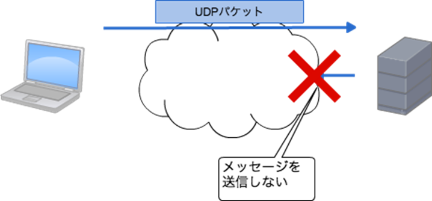

<!--
title:   Nampことはじめ
tags:    Nmap,Security,ハッキング
id:      db7b08935d97e29998ff
private: true
-->


## はじめに

攻撃対象の情報を収集しなければ、攻撃をすることはできません。情報を収集するプロセスのことを「Enumeration」と呼びます。「Enumeration」では一般的にポートスキャンが最初に行われます。ポートスキャンすることでシステムのどのポートが空いているか、どのようなサービスが実行されているのかを把握できます。ポートスキャンはNmapというツールを使用するのが一般的です。Nmapは指定したターゲットのポートに様々な方法でアクセスを試みその結果を返却します。ポートの開閉状態の他、稼働しているサービスやOS情報も取得できます。

Nmap Switches

SYNスキャン

-sS

root@ip-10-10-199-68:~# nmap -sS 10.10.69.154Starting Nmap 7.60 ( https://nmap.org ) at 2023-02-18 13:44 GMTNmap scan report for ip-10-10-69-154.eu-west-1.compute.internal (10.10.69.154)Host is up (0.00052s latency).Not shown: 995 filtered portsPORT STATE SERVICE21/tcp open ftp53/tcp open domain80/tcp open http135/tcp open msrpc3389/tcp open ms-wbt-serverMAC Address: 02:A3:BA:BA:DE:C9 (Unknown)Nmap done: 1 IP address (1 host up) scanned in 18.98 seconds

UDPスキャン

-sU

root@ip-10-10-199-68:~# nmap -sU 10.10.69.154Starting Nmap 7.60 ( https://nmap.org ) at 2023-02-18 13:53 GMTNmap scan report for ip-10-10-69-154.eu-west-1.compute.internal (10.10.69.154)Host is up (0.00034s latency).Not shown: 999 open|filtered portsPORT STATE SERVICE53/udp open domainMAC Address: 02:A3:BA:BA:DE:C9 (Unknown)Nmap done: 1 IP address (1 host up) scanned in 115.51 seconds

ターゲットのOSを確認

-O

SYNスキャンと似ているがMAC Address以降が異なる。内容からOS検出に失敗している。

https://kaworu.jpn.org/security/nmap_OS%E6%A4%9C%E5%87%BA


root@ip-10-10-199-68:~# nmap -O 10.10.69.154Starting Nmap 7.60 ( https://nmap.org ) at 2023-02-18 14:01 GMTNmap scan report for ip-10-10-69-154.eu-west-1.compute.internal (10.10.69.154)Host is up (0.00050s latency).Not shown: 995 filtered portsPORT STATE SERVICE21/tcp open ftp53/tcp open domain80/tcp open http135/tcp open msrpc3389/tcp open ms-wbt-serverMAC Address: 02:A3:BA:BA:DE:C9 (Unknown)Warning: OSScan results may be unreliable because we could not find at least 1 open and 1 closed portOS fingerprint not ideal because: Missing a closed TCP port so results incompleteNo OS matches for hostNetwork Distance: 1 hopOS detection performed. Please report any incorrect results at https://nmap.org/submit/ .Nmap done: 1 IP address (1 host up) scanned in 22.06 seconds

動作しているサービスのバージョンを確認

-sV

SYNスキャンで検出したサービスのバージョン（詳細情報）を表示する。また、Service Info（MAC Addressの以降の情報）から動作しているOSがわかる。

root@ip-10-10-199-68:~# nmap -sV 10.10.69.154Starting Nmap 7.60 ( https://nmap.org ) at 2023-02-18 14:12 GMTNmap scan report for ip-10-10-69-154.eu-west-1.compute.internal (10.10.69.154)Host is up (0.00060s latency).Not shown: 995 filtered portsPORT STATE SERVICE VERSION21/tcp open ftp FileZilla ftpd53/tcp open domain Microsoft DNS80/tcp open http Microsoft IIS httpd 10.0135/tcp open msrpc Microsoft Windows RPC3389/tcp open ms-wbt-server Microsoft Terminal ServicesMAC Address: 02:A3:BA:BA:DE:C9 (Unknown)Service Info: OS: Windows; CPE: cpe:/o:microsoft:windowsService detection performed. Please report any incorrect results at https://nmap.org/submit/ .Nmap done: 1 IP address (1 host up) scanned in 29.30 seconds

ポートスキャン詳細情報表示

-v

root@ip-10-10-199-68:~# nmap -v 10.10.69.154Starting Nmap 7.60 ( https://nmap.org ) at 2023-02-18 14:20 GMTInitiating ARP Ping Scan at 14:20Scanning 10.10.69.154[1 port]Completed ARP Ping Scan at 14:20, 0.22s elapsed (1 total hosts)Initiating Parallel DNS resolution of 1 host. at 14:20Completed Parallel DNS resolution of 1 host. at 14:20, 0.00s elapsedInitiating SYN Stealth Scan at 14:20Scanning ip-10-10-69-154.eu-west-1.compute.internal (10.10.69.154)[1000 ports]Discovered open port 80/tcp on 10.10.69.154Discovered open port 135/tcp on 10.10.69.154Discovered open port 21/tcp on 10.10.69.154Discovered open port 53/tcp on 10.10.69.154Discovered open port 3389/tcp on 10.10.69.154Completed SYN Stealth Scan at 14:21, 17.34s elapsed (1000 total ports)Nmap scan report for ip-10-10-69-154.eu-west-1.compute.internal (10.10.69.154)Host is up (0.00059s latency).Not shown: 995 filtered portsPORT STATE SERVICE21/tcp open ftp53/tcp open domain80/tcp open http135/tcp open msrpc3389/tcp open ms-wbt-serverMAC Address: 02:A3:BA:BA:DE:C9 (Unknown)Read data files from: /usr/bin/../share/nmapNmap done: 1 IP address (1 host up) scanned in 17.69 secondsRaw packets sent: 3005 (132.204KB) | Rcvd: 20 (864B)

ポートスキャンのより詳細な情報表示

-vv

PORTの表にREASONが追加されているなど。

root@ip-10-10-199-68:~# nmap -vv 10.10.69.154Starting Nmap 7.60 ( https://nmap.org ) at 2023-02-18 14:25 GMTInitiating ARP Ping Scan at 14:25Scanning 10.10.69.154[1 port]Completed ARP Ping Scan at 14:25, 0.23s elapsed (1 total hosts)Initiating Parallel DNS resolution of 1 host. at 14:25Completed Parallel DNS resolution of 1 host. at 14:25, 0.00s elapsedInitiating SYN Stealth Scan at 14:25Scanning ip-10-10-69-154.eu-west-1.compute.internal (10.10.69.154)[1000 ports]Discovered open port 3389/tcp on 10.10.69.154Discovered open port 53/tcp on 10.10.69.154Discovered open port 135/tcp on 10.10.69.154Discovered open port 80/tcp on 10.10.69.154Discovered open port 21/tcp on 10.10.69.154Increasing send delay for 10.10.69.154 from 0 to 5 due to 11 out of 28 dropped probes since last increase.Completed SYN Stealth Scan at 14:25, 19.51s elapsed (1000 total ports)Nmap scan report for ip-10-10-69-154.eu-west-1.compute.internal (10.10.69.154)Host is up, received arp-response (0.00054s latency).Scanned at 2023-02-18 14:25:08 GMT for 20sNot shown: 995 filtered portsReason: 995 no-responsesPORT STATE SERVICE REASON21/tcp open ftp syn-ack ttl 12853/tcp open domain syn-ack ttl 12880/tcp open http syn-ack ttl 128135/tcp open msrpc syn-ack ttl 1283389/tcp open ms-wbt-server syn-ack ttl 128MAC Address: 02:A3:BA:BA:DE:C9 (Unknown)Read data files from: /usr/bin/../share/nmapNmap done: 1 IP address (1 host up) scanned in 19.85 secondsRaw packets sent: 3008 (132.336KB) | Rcvd: 23 (996B)

出力形式を指定する（標準）

-oN <ファイル名>標準出力と同じようにファイルに出力される。

root@ip-10-10-199-68:~# nmap 10.10.69.154 -oN on.txtStarting Nmap 7.60 ( https://nmap.org ) at 2023-02-18 14:42 GMTNmap scan report for ip-10-10-69-154.eu-west-1.compute.internal (10.10.69.154)Host is up (0.00061s latency).Not shown: 995 filtered portsPORT STATE SERVICE21/tcp open ftp53/tcp open domain80/tcp open http135/tcp open msrpc3389/tcp open ms-wbt-serverMAC Address: 02:A3:BA:BA:DE:C9 (Unknown)Nmap done: 1 IP address (1 host up) scanned in 17.39 secondsroot@ip-10-10-199-68:~# ls10.10.69.154 10.10.69.154.nmap Desktop Instructions Pictures Rooms thinclient_drives10.10.69.154.gnmap 10.10.69.154.xml Downloads on.txt Postman Scripts Toolsroot@ip-10-10-199-68:~# cat on.txt Nmap 7.60 scan initiated Sat Feb 18 14:42:17 2023 as: nmap -oN on.txt 10.10.69.154Nmap scan report for ip-10-10-69-154.eu-west-1.compute.internal (10.10.69.154)Host is up (0.00061s latency).Not shown: 995 filtered portsPORT STATE SERVICE21/tcp open ftp53/tcp open domain80/tcp open http135/tcp open msrpc3389/tcp open ms-wbt-serverMAC Address: 02:A3:BA:BA:DE:C9 (Unknown)Nmap done at Sat Feb 18 14:42:34 2023 -- 1 IP address (1 host up) scanned in 17.39 seconds

出力形式を指定する（Grep検索可能出力）

-oG

この出力フォーマットを最後に取り上げたのは、廃止予定だからだ。XML出力フォーマットのほうがはるかに強力であり、熟練ユーザにとっての使い勝手もほぼ変わらない。XMLはパーサーの標準で、多数の優れたXMLパーサーが利用可能になっているのに対し、grep可能出力は筆者独自のスクリプトに過ぎない。XMLは拡張性が高く、Nmapの新機能がリリースされるたびに対応可能だが、grep可能出力にはこうした機能を追加する余地がないため、割愛せざるを得ないことも多い。

https://nmap.org/man/ja/man-output.html

root@ip-10-10-199-68:~# nmap 10.10.69.154 -oG oG.txtStarting Nmap 7.60 ( https://nmap.org ) at 2023-02-18 14:45 GMTNmap scan report for ip-10-10-69-154.eu-west-1.compute.internal (10.10.69.154)Host is up (0.00056s latency).Not shown: 995 filtered portsPORT STATE SERVICE21/tcp open ftp53/tcp open domain80/tcp open http135/tcp open msrpc3389/tcp open ms-wbt-serverMAC Address: 02:A3:BA:BA:DE:C9 (Unknown)Nmap done: 1 IP address (1 host up) scanned in 17.71 secondsroot@ip-10-10-199-68:~# cat oG.txt Nmap 7.60 scan initiated Sat Feb 18 14:45:26 2023 as: nmap -oG oG.txt 10.10.69.154Host: 10.10.69.154 (ip-10-10-69-154.eu-west-1.compute.internal) Status: UpHost: 10.10.69.154 (ip-10-10-69-154.eu-west-1.compute.internal) Ports: 21/open/tcp//ftp///, 53/open/tcp//domain///, 80/open/tcp//http///, 135/open/tcp//msrpc///, 3389/open/tcp//ms-wbt-server/// Ignored State: filtered (995)Nmap done at Sat Feb 18 14:45:43 2023 -- 1 IP address (1 host up) scanned in 17.71 seconds

出力形式を指定する（主要3種類）

-oA標準、Grep検索可能出力、XMLそれぞれの形式でファイルを出力する。

root@ip-10-10-199-68:~# nmap 10.10.69.154 -oA oA.txtStarting Nmap 7.60 ( https://nmap.org ) at 2023-02-18 14:50 GMTNmap scan report for ip-10-10-69-154.eu-west-1.compute.internal (10.10.69.154)Host is up (0.00053s latency).Not shown: 995 filtered portsPORT STATE SERVICE21/tcp open ftp53/tcp open domain80/tcp open http135/tcp open msrpc3389/tcp open ms-wbt-serverMAC Address: 02:A3:BA:BA:DE:C9 (Unknown)Nmap done: 1 IP address (1 host up) scanned in 18.82 secondsroot@ip-10-10-199-68:~# ls oA.txt.*oA.txt.gnmap oA.txt.nmap oA.txt.xmlroot@ip-10-10-199-68:~# cat oA.txt.gnmap Nmap 7.60 scan initiated Sat Feb 18 14:50:37 2023 as: nmap -oA oA.txt 10.10.69.154Host: 10.10.69.154 (ip-10-10-69-154.eu-west-1.compute.internal) Status: UpHost: 10.10.69.154 (ip-10-10-69-154.eu-west-1.compute.internal) Ports: 21/open/tcp//ftp///, 53/open/tcp//domain///, 80/open/tcp//http///, 135/open/tcp//msrpc///, 3389/open/tcp//ms-wbt-server/// Ignored State: filtered (995)Nmap done at Sat Feb 18 14:50:56 2023 -- 1 IP address (1 host up) scanned in 18.82 secondsroot@ip-10-10-199-68:~# cat oA.txt.nmap Nmap 7.60 scan initiated Sat Feb 18 14:50:37 2023 as: nmap -oA oA.txt 10.10.69.154Nmap scan report for ip-10-10-69-154.eu-west-1.compute.internal (10.10.69.154)Host is up (0.00053s latency).Not shown: 995 filtered portsPORT STATE SERVICE21/tcp open ftp53/tcp open domain80/tcp open http135/tcp open msrpc3389/tcp open ms-wbt-serverMAC Address: 02:A3:BA:BA:DE:C9 (Unknown)Nmap done at Sat Feb 18 14:50:56 2023 -- 1 IP address (1 host up) scanned in 18.82 secondsroot@ip-10-10-199-68:~# cat oA.txt.xml<?xml version="1.0" encoding="UTF-8"?><!DOCTYPE nmaprun><?xml-stylesheet href="file:///usr/bin/../share/nmap/nmap.xsl" type="text/xsl"?><!-- Nmap 7.60 scan initiated Sat Feb 18 14:50:37 2023 as: nmap -oA oA.txt 10.10.69.154 -->略

アグレッシブモード有効

-Aサービス検出、オペレーティングシステム検出、トレースルート、一般的なスクリプトのスキャンを有効にする。

root@ip-10-10-157-169:~# nmap -A 10.10.237.71Starting Nmap 7.60 ( https://nmap.org ) at 2023-02-19 15:53 GMTNmap scan report for ip-10-10-237-71.eu-west-1.compute.internal (10.10.237.71)Host is up (0.00053s latency).Not shown: 995 filtered portsPORT STATE SERVICE VERSION21/tcp open ftp FileZilla ftpd| ftp-anon: Anonymous FTP login allowed (FTP code 230)|Can't get directory listing: TIMEOUT| ftp-syst:| SYST: UNIX emulated by FileZilla53/tcp open domain Microsoft DNS80/tcp open http Microsoft IIS httpd 10.0| http-methods:|_ Potentially risky methods: TRACE|_http-server-header: Microsoft-IIS/10.0|_http-title: IIS Windows Server135/tcp open msrpc Microsoft Windows RPC3389/tcp open ms-wbt-server Microsoft Terminal Services| ssl-cert: Subject: commonName=win-scan| Not valid before: 2023-02-18T15:53:31|_Not valid after: 2023-08-20T15:53:31|_ssl-date: 2023-02-19T15:54:17+00:00; 0s from scanner time.MAC Address: 02:80:3B:E7:39:F7 (Unknown)Warning: OSScan results may be unreliable because we could not find at least 1 open and 1 closed portDevice type: specializedRunning (JUST GUESSING): AVtech embedded (87%)Aggressive OS guesses: AVtech Room Alert 26W environmental monitor (87%)No exact OS matches for host (test conditions non-ideal).Network Distance: 1 hopService Info: OS: Windows; CPE: cpe:/o:microsoft:windowsTRACEROUTEHOP RTT ADDRESS1 0.53 ms ip-10-10-237-71.eu-west-1.compute.internal (10.10.237.71)OS and Service detection performed. Please report any incorrect results at https://nmap.org/submit/ .Nmap done: 1 IP address (1 host up) scanned in 66.68 seconds

スキャン速度指定（タイミングテンプレート）-T0数値部分は0から5まで指定可能。数値が大きいほどスキャン速度が速いが、エラーになる可能性も高くなる。

https://cysec148.hatenablog.com/entry/2020/12/16/184934


root@ip-10-10-157-169:~# nmap -T5 10.10.237.71Starting Nmap 7.60 ( https://nmap.org ) at 2023-02-19 15:58 GMTNmap scan report for ip-10-10-237-71.eu-west-1.compute.internal (10.10.237.71)Host is up (0.00067s latency).Not shown: 995 filtered portsPORT STATE SERVICE21/tcp open ftp53/tcp open domain80/tcp open http135/tcp open msrpc3389/tcp open ms-wbt-serverMAC Address: 02:80:3B:E7:39:F7 (Unknown)Nmap done: 1 IP address (1 host up) scanned in 10.19 seconds

-T5だと10秒程度でスキャンできた。

ポート指定

-pポート番号

root@ip-10-10-157-169:~# nmap -p 80 10.10.237.71Starting Nmap 7.60 ( https://nmap.org ) at 2023-02-19 16:04 GMTNmap scan report for ip-10-10-237-71.eu-west-1.compute.internal (10.10.237.71)Host is up (0.00030s latency).PORT STATE SERVICE80/tcp open httpMAC Address: 02:80:3B:E7:39:F7 (Unknown)Nmap done: 1 IP address (1 host up) scanned in 0.56 seconds

ポート指定（範囲指定）

-p開始ポート番号-終了ポート番号

root@ip-10-10-157-169:~# nmap -p 80 10.10.237.71Starting Nmap 7.60 ( https://nmap.org ) at 2023-02-19 16:04 GMTNmap scan report for ip-10-10-237-71.eu-west-1.compute.internal (10.10.237.71)Host is up (0.00030s latency).PORT STATE SERVICE80/tcp open httpMAC Address: 02:80:3B:E7:39:F7 (Unknown)Nmap done: 1 IP address (1 host up) scanned in 0.56 seconds

ポート指定（全ポート指定）

-p-30分ぐらい経っても結果が返ってこなかったため諦めた。

vulnカテゴリのスクリプト実行

--script=vulnhttp-csrfなど脆弱性を検出するスクリプト群を実行してくれる。

https://nmap.org/nsedoc/categories/vuln.html

root@ip-10-10-157-169:~# nmap --script=vuln 10.10.237.71Starting Nmap 7.60 ( https://nmap.org ) at 2023-02-19 16:10 GMTNmap scan report for ip-10-10-237-71.eu-west-1.compute.internal (10.10.237.71)Host is up (0.00055s latency).Not shown: 995 filtered portsPORT STATE SERVICE21/tcp open ftp|_sslv2-drown:53/tcp open domain80/tcp open http|_http-csrf: Couldn't find any CSRF vulnerabilities.|_http-dombased-xss: Couldn't find any DOM based XSS.|_http-stored-xss: Couldn't find any stored XSS vulnerabilities.135/tcp open msrpc3389/tcp open ms-wbt-server|_sslv2-drown:MAC Address: 02:80:3B:E7:39:F7 (Unknown)Nmap done: 1 IP address (1 host up) scanned in 153.62 seconds


## Scan Types Overview

Nmapには3つの基本的なスキャンタイプがある。

- TCPコネクトスキャン(-sT)

root@ip-10-10-236-185:~# nmap -sT 10.10.62.95
Starting Nmap 7.60 ( https://nmap.org ) at 2023-02-23 06:01 GMT
Nmap scan report for ip-10-10-62-95.eu-west-1.compute.internal (10.10.62.95)
Host is up (0.00058s latency).
Not shown: 995 filtered ports
PORT     STATE SERVICE
21/tcp   open  ftp
53/tcp   open  domain
80/tcp   open  http
135/tcp  open  msrpc
3389/tcp open  ms-wbt-server
MAC Address: 02:95:AF:BB:24:03 (Unknown)
Nmap done: 1 IP address (1 host up) scanned in 12.78 seconds


- SYNハーフオープンスキャン(-sS)※結果は上に記載
- UDPスキャン(-sU)　※結果は上に記載

一般的ではないが、他にも以下スキャンタイプがある。

- TCP NULLスキャン(-sN)
結果が取得できなかった
root@ip-10-10-236-185:~# nmap -sN 10.10.62.95
Starting Nmap 7.60 ( https://nmap.org ) at 2023-02-23 06:03 GMT
Nmap scan report for ip-10-10-62-95.eu-west-1.compute.internal (10.10.62.95)
Host is up (0.00010s latency).
All 1000 scanned ports on ip-10-10-62-95.eu-west-1.compute.internal (10.10.62.95) are open|filtered
MAC Address: 02:95:AF:BB:24:03 (Unknown)
Nmap done: 1 IP address (1 host up) scanned in 21.43 seconds


- TCP FINスキャン(-sF)
こちらもNULLスキャンと同じ結果になった
root@ip-10-10-236-185:~# nmap -sF 10.10.62.95
Starting Nmap 7.60 ( https://nmap.org ) at 2023-02-23 06:05 GMT
Nmap scan report for ip-10-10-62-95.eu-west-1.compute.internal (10.10.62.95)
Host is up (0.00011s latency).
All 1000 scanned ports on ip-10-10-62-95.eu-west-1.compute.internal (10.10.62.95) are open|filtered
MAC Address: 02:95:AF:BB:24:03 (Unknown)
Nmap done: 1 IP address (1 host up) scanned in 21.43 seconds


- TCP Xmasスキャン(-sX)
上2つと同じ結果になった
root@ip-10-10-236-185:~# nmap -sX 10.10.62.95
Starting Nmap 7.60 ( https://nmap.org ) at 2023-02-23 06:08 GMT
Nmap scan report for ip-10-10-62-95.eu-west-1.compute.internal (10.10.62.95)
Host is up (0.00017s latency).
All 1000 scanned ports on ip-10-10-62-95.eu-west-1.compute.internal (10.10.62.95) are open|filtered
MAC Address: 02:95:AF:BB:24:03 (Unknown)
Nmap done: 1 IP address (1 host up) scanned in 21.42 seconds

これらスキャンタイプの中でUDPスキャンが最も使用されることが多い。

## Scan Types TCP Connect Scans

TCPコネクトスキャン(-sT)は、SYNフラグをたてたTCPリクエストをターゲットに送信し、TCP3ウェイハンドシェイクが成立したかどうかでポート開閉を判断するスキャンタイプです。
SYNハーフオープンスキャン(-sS)の場合、ターゲットにSYNを送信するだけで判断しますが、こちらはACKまで送信し、TCPコネクションを確立させます。


[https://ja.wikipedia.org/wiki/3ウェイ・ハンドシェイク](ttps://ja.wikipedia.org/wiki/3ウェイ・ハンドシェイク)より

NmapはターゲットポートにSYNフラグをたてたTCPリクエストを送信します。ターゲットポートが開いていた場合、SYN+ACKをクライアント側に返します。この時、Nmapはそのポートが開いていると判断し、ACKをターゲットに送信して、TCPコネクションを確立させます。

ターゲットポートが閉じていた場合はどのような動作になるでしょうか？
[RFC793](https://www.rfc-editor.org/rfc/rfc793)では次のように記載されています。

>    1.  If the connection does not exist (CLOSED) then a reset is sent
    in response to any incoming segment except another reset.  In
    particular, SYNs addressed to a non-existent connection are rejected
    by this means.

つまり、閉じたポートにSYNを送信すると、RSTフラグをたてたレスポンスを受け取ります。
NmapはRSTを受け取ることでターゲットポートが閉じられていると判断します。

ポートが開いているが、ファイアウォールにより保護されている場合はどのような動作になるでしょうか？
ファイアウォールの多くは保護しているポートへのパケットをドロップするように設定されています。
そのため、Nmapがファイアウォールに保護されているポートにSYNを送信した場合、レスポンスが何も返ってこないことになります。
Nmapはそのような場合、ポートがフィルタリングされていると判断します。

多くのファイアウォールは、単に着信パケットをドロップするように設定されている。Nmapは、TCP SYNリクエストを送信しても、何も戻ってこない。これは、ポートがファイアウォールによって保護されていることを示しており、したがって、ポートはフィルタリングされていると考えられる。

ポートがフィルタリングされているという情報は攻撃者にとって有益な情報になる可能性があります。
そのため、ファイアウォールに保護されたポートにSYNが送信されたらRSTを返却するように設定するということもセキュリティを向上させる対応といえます。
例えば、LinuxのIPtablesでは以下のコマンドで設定できます。

```
iptables -I INPUT -p tcp --dport <port> -j REJECT --reject-with tcp-reset
```

## Scan Types SYN Scans

SYNスキャン(-sS)は、TCPコネクトスキャンと同様にターゲットポートが開いているかどうかを判断するスキャンです。
ただし、スキャンの方法がTCPコネクトスキャンと異なり、その方法から**ハーフオープン**スキャン、**ステルス**スキャンと呼ばれることがあります。
TCPコネクトスキャンはターゲットと3ウェイハンドシェイクにより、コネクションを確立します。
一方、SYNスキャンはターゲットからSYN+ACK受取後、RSTを送り返し、コネクションを確立せず、終了します。


[https://www.geeksforgeeks.org/what-is-syn-scanning/](https://www.geeksforgeeks.org/what-is-syn-scanning/)より

SYNスキャンは主に3つのメリットがあります。
１つ目は、進入検知システム（IDS）の検知から逃れることができる可能性が高まることです。
古いタイプのIDSは3ウェイハンドシェイクによりコネクションが確立されたかを監視しているため、コネクションを確立しないSYNスキャンは検知されない可能性が高まります。
ただし、最近のIDSは例外のようです。
２つ目は、接続を試行したことがログに記録されない可能性が高くなるということです。
一般的なシステムでは3ウェイハンドシェイクによるコネクションが確立した時、それをログに記録します。
SYNスキャンではコネクションは確立しないため、ログに記録されません。
３つ目は、スキャンが高速であるということです。
TCPコネクトスキャンのように3ウェイハンドシェイクによるコネクションを確立する必要がないため、高速にスキャンできます。

一方でSYNスキャンにはデメリットもあります。
１つ目は、Linux環境でNmapでSYNスキャンを実行する際はsudo権限が必要になることです。
これは、SYNスキャンの生パケット送受信時にsudo権限が必要だからです。

https://nmap.org/man/ja/man-port-scanning-techniques.html

２つ目は、不安定なサービスにSYNスキャンをした場合、負荷によりダウンする可能性があることです。
テスト用に本番環境を利用する際は十分に注意する必要があります。

以上のメリット、デメリットからsudo権限でNmapを実行した場合、SYNスキャンがデフォルトで実行されます。
sudo権限なしの場合、TCPコネクトスキャンがデフォルトで実行されます。

ターゲットポートが閉じていた場合やポートがファイアウォールによりフィルタリングされている場合はどのような動作になるでしょうか？
この場合、TCPコネクトスキャンと同じ動きになります。
つまり、ポートが閉じていた場合、RSTを受け取ります。フィルタリングされていた場合、SYNパケットがドロップされます。

SYNスキャンを使用してクローズドポートとフィルタリングされたポートを識別する場合、TCPコネクトスキャンとまったく同じルールが適用されます。

## Scan Type UDP Scans

UDPスキャン(-sU)は、[UDP](https://www.infraexpert.com/study/tcpip12.html)を利用したスキャンです。
UDPはTCPと異なり、3ウェイハンドシェイクはせず、ターゲットとコネクションを確立しません。
そのため、TCPと比べ高速に通信できますが、信頼性が低いステートレスなプロトコルです。
UDPスキャンはそのUDPの性質のため、ターゲットポートにパケットを送信しても応答はありません。
そのため、難しく、また、とても時間がかかるスキャンになります。

開いているUDPポートにパケットを送信するとどうなるでしょうか？
UDPの性質上応答はないはずです。Nmapはこの際、そのUDPポートを**open/filtered**と判断します。
つまり、そのポートが開いているか、ファイアウォールによりフィルタリングされているか、どちらかの状態ということです。


[https://www.kagoya.jp/howto/engineer/infosecurity/port-scanning/](https://www.kagoya.jp/howto/engineer/infosecurity/port-scanning/)より

閉じているポートにパケットを送信するとどうなるでしょうか？
この場合、ターゲットから**ICMP Port Unreachable**パケットが返却されます。
Nmapはこの応答からポートが閉じていると判断します。


[https://www.kagoya.jp/howto/engineer/infosecurity/port-scanning/](https://www.kagoya.jp/howto/engineer/infosecurity/port-scanning/)より

ポートが開いているか判断が難しいため、UDPスキャンは他のTCPスキャンよりもスキャンに時間がかかります。
スキャン時間短縮のため、**-top-ports <number>**オプションを使用した方が効率的です。
例えば、**<number>**を**20**としてUDPスキャンした場合、最もよく利用されるTOP20個のUDPポートに対してスキャンを行い、スキャン時間を大幅に短縮することができます。


## 問題

参考としている[TryHackMeのNmap](https://tryhackme.com/room/furthernmap)に記載されている問題と答えを記載します。

### Introduction

What networking constructs are used to direct traffic to the right application on a server?

Ports

How many of these are available on any network-enabled computer?

65535

[Research]How many of these are considered "well-known"? (These are the "standard" numbers mentioned in the task)

1024

### Scan Types TCP Connect Scans

Which RFC defines the appropriate behaviour for the TCP protocol?

RFC 793

If a port is closed, which flag should the server send back to indicate this?

RST

### Scan Types SYN Scans

There are two other names for a SYN scan, what are they?

Half-Open, Stealth

Can Nmap use a SYN scan without Sudo permissions (Y/N)?

N

### Scan Type UDP Scans

If a UDP port doesn't respond to an Nmap scan, what will it be marked as?

open|filtered

When a UDP port is closed, by convention the target should send back a "port unreachable" message. Which protocol would it use to do so?

ICMP


## 参考

https://tryhackme.com/room/furthernmap
https://ja.wikipedia.org/wiki/3ウェイ・ハンドシェイク